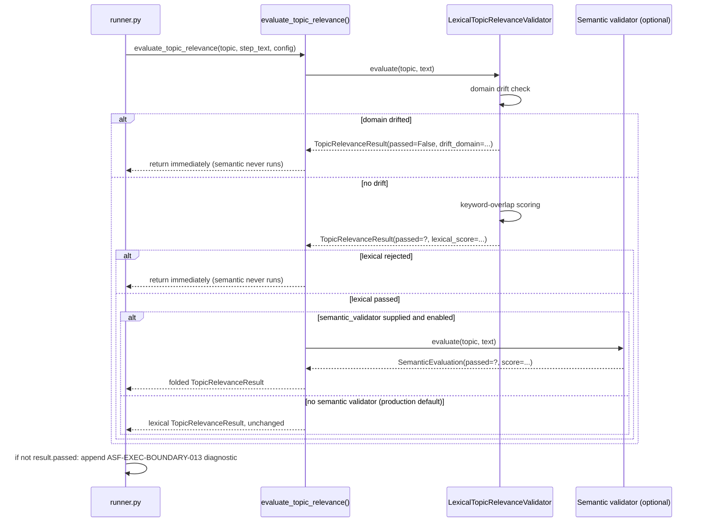

# Topic Relevance Subsystem

This document explains how the Ollama execution adapter decides whether
generated Research / Content Creation / Review Quality output actually
stays on the topic the caller requested, and how to extend each piece of
that decision safely.

Everything described here is **deterministic by default**: no network
call, no bundled ML model, no non-reproducible behavior. The one optional
exception (a real embedding-based semantic check) is off unless a caller
explicitly wires one in and enables it.

## Module map

| Module | Responsibility |
| --- | --- |
| `topic_relevance_config.py` | The single source of truth for every tunable: threshold, allowlist, stopwords, domain vocabulary. Loads/validates/merges JSON overrides. |
| `tokenization.py` | Turns raw text into normalized tokens. `Tokenizer` protocol + `TokenizerRegistry` extension point. |
| `domain_classification.py` | Tags text with zero or more configured domain labels (`DomainClassifier` protocol + `KeywordDomainClassifier`). |
| `semantic.py` | Disabled-by-default scaffolding for an embedding-based relevance check (`EmbeddingProvider`, `SemanticSimilarity`, `SemanticRelevanceValidator`). |
| `topic_relevance.py` | Orchestration facade: `LexicalTopicRelevanceValidator`, `TopicRelevanceResult`, `evaluate_topic_relevance()`. The only entry point `runner.py` calls. |
| `runner.py` | Consumes `evaluate_topic_relevance(...).passed` to accept or reject a step's output as an `ASF-EXEC-BOUNDARY-013` diagnostic. |

## Execution flow

`runner.py` loads configuration once at import time and calls
`evaluate_topic_relevance` once per pipeline step (research, content
creation, review quality) whenever a `topic` was supplied:



Key invariant: **the semantic pass never runs on text the lexical pass
already rejected**, and in production `runner.py` never supplies a
`semantic_validator` at all -- so embedding work is not just "disabled",
it is structurally absent from the default call path. Both properties are
covered by `tests/test_integration_execution_path.py`.

## The lexical pipeline

`LexicalTopicRelevanceValidator.evaluate(topic, text)`:

```
topic, text
   │
   ├──> DomainClassifier.matches(topic)  ──┐
   ├──> DomainClassifier.matches(text)   ──┤──> drifted = text_domains - topic_domains
   │                                        │    (domain present in output, absent from topic)
   │                                        └──> if non-empty: REJECT, domain_score=0.0
   │
   └──> (no drift) Tokenizer.tokenize(topic) / .tokenize(text)
             │
             └──> keyword sets, filtered by short_keyword_allowlist / stopwords
                        │
                        └──> lexical_score = |matched| / |topic_keywords|
                                   │
                                   └──> passed = lexical_score >= min_relevance_score
```

Two independent gates, evaluated in this order:

1. **Domain drift** -- a domain classified in the output text but not in the
   topic (e.g. a "5 scariest AI technologies" topic drifting into
   "AI for environmental protection" content) is rejected outright,
   regardless of keyword overlap. This catches whole-subject drift that
   keyword overlap alone would miss (drifted content often still repeats
   generic words like "AI").
2. **Keyword overlap** -- if no domain drifted, the fraction of the topic's
   significant keywords that also appear in the output must clear
   `min_relevance_score` (default `0.2`).

`TopicRelevanceResult` (see `topic_relevance.py`) exposes both the pass/fail
verdict (`passed`, the only field `runner.py` needs) and full diagnostics
for debugging: `lexical_score`, `matched_keywords`, `missing_keywords`,
`detected_domains`, `drift_domain`, `reason`, `validator_chain`,
`confidence`. `relevant` is kept as a read-only alias of `passed` for
backward compatibility with pre-refactor callers.

## Tokenizer registry

```
Tokenizer (protocol): tokenize(text) -> tuple[str, ...]
   └── WhitespaceRegexTokenizer (default): casefold + strip diacritics
       (including Vietnamese "đ", which does not decompose under NFD)
       + split on runs of [a-z0-9]

TokenizerRegistry: language code -> Tokenizer, falls back to a default
   DEFAULT_TOKENIZER_REGISTRY.register("en", WhitespaceRegexTokenizer())
   DEFAULT_TOKENIZER_REGISTRY.register("vi", WhitespaceRegexTokenizer())
```

This is a dependency-free, syllable-level baseline -- it is *not* true word
segmentation (multi-syllable Vietnamese words still split per syllable).
That is an accepted limitation, not a bug: see "Extending" below for how to
register a real segmenter without touching any other module.

**Current wiring note:** `LexicalTopicRelevanceValidator` takes a single
`Tokenizer` via constructor injection (default `DEFAULT_TOKENIZER`); it does
not yet resolve one per-language through `TokenizerRegistry` automatically,
because nothing upstream currently detects or passes the topic/text
language. The registry is a ready extension point, not (yet) an active
code path -- see "Extension guidelines" below.

## Domain classifier

```
DomainClassifier (protocol): matches(text) -> frozenset[str]
   └── KeywordDomainClassifier(domain_terms, min_occurrences=2)
         For each configured domain, count \b-anchored (whole-word)
         occurrences of its indicator phrases in the normalized text.
         A domain is "matched" once the total occurrence count across
         all of its indicators reaches min_occurrences.
```

Word-boundary anchoring means a single-word indicator like `"car"` will not
fire on `"cartoon"`, and `"net"` will not fire on `"internet"`, while a
multi-word phrase like `"climate change"` still matches as a whole phrase
(and, as a side effect, no longer matches inside `"climate changed"`, since
there is no boundary between `"change"` and the trailing `"d"`).

Domains are pure configuration data (see below) -- nothing in this module
hard-codes "environment" or any other domain name.

## Configuration loading

```
load_topic_relevance_config(path=None)
   │
   ├── path given?               ──> read+validate that file
   ├── else ASF_OLLAMA_TOPIC_RELEVANCE_CONFIG env var set? ──> read+validate that file
   └── else                       ──> DEFAULT_TOPIC_RELEVANCE_CONFIG (zero config needed)
```

Overrides are merged onto the defaults field-by-field, not swapped in
wholesale:

- `short_keyword_allowlist` / `stopwords`: **unioned** with the built-in
  set (an override adds to the defaults; it cannot silently remove
  built-in coverage).
- `domain_terms`: merged **per domain key**, case-insensitively (an
  override for `"Environment"` folds onto the built-in `"environment"`
  entry rather than creating a near-duplicate). The legacy key
  `offtopic_drift_terms` is still accepted as an alias but emits a
  `DeprecationWarning`; if the same domain is defined in both places, the
  `domain_terms` definition wins and a `UserWarning` explains why.
- Scalars (`min_relevance_score`, `min_domain_indicator_occurrences`,
  `semantic_similarity_threshold`, `config_version`) are plain overrides,
  each range/type-validated.

Failure modes are deliberately explicit rather than silent or a raw
stack trace:

| Problem | Behavior |
| --- | --- |
| Override path does not exist | `TopicRelevanceConfigNotFoundError` (also an instance of `FileNotFoundError`) |
| Override file is not valid JSON | `TopicRelevanceConfigError`, names the file and the JSON error |
| Override JSON is not an object | `TopicRelevanceConfigError` |
| A scalar field has the wrong type or is out of range | `TopicRelevanceConfigError`, names the field, the value received, and what was expected |
| Two domain keys in the same source normalize to the same label (e.g. `"Finance"` and `"finance"`) | `TopicRelevanceConfigError` -- ambiguous, so it fails loudly instead of guessing |
| An unrecognized top-level key is present | `UserWarning`, but the rest of the file still loads (forward-compatible) |
| The deprecated `offtopic_drift_terms` key is used | `DeprecationWarning`, but it still works |

**Config is loaded once, at `runner.py` import time** (`_TOPIC_RELEVANCE_CONFIG
= load_topic_relevance_config()` at module scope) -- not re-read per
request. Changing the environment variable mid-process has no effect until
the process (or, in tests, the module) is reloaded. This is a deliberate
simplicity/predictability trade-off for a short-lived CLI-invoked adapter,
not an oversight; `tests/test_integration_execution_path.py` documents and
exercises it directly via `importlib.reload`.

## Semantic extension point

Disabled by default and structurally absent from the production call path
(`runner.py` never passes a `semantic_validator` argument at all). To wire
in a real embedding model:

```python
from ollama_execution.semantic import CosineSimilarity, SemanticRelevanceValidator
from ollama_execution.topic_relevance import evaluate_topic_relevance

class MyEmbeddingProvider:
    def embed(self, text: str) -> tuple[float, ...]:
        return my_model.encode(text)  # e.g. BGE / E5 / MiniLM

validator = SemanticRelevanceValidator(
    embedding_provider=MyEmbeddingProvider(),
    similarity=CosineSimilarity(),   # or your own SemanticSimilarity
    threshold=0.75,
    enabled=True,
)

result = evaluate_topic_relevance(topic, text, config=config, semantic_validator=validator)
```

The semantic pass only ever runs after the lexical pass has already
accepted the text -- it can veto a lexically-passing result, but it never
gets a chance to override a lexical rejection, and it never sees text
already known to be off-topic.

## Extension guidelines

- **Add a domain** (Finance, Travel, Gaming, Medicine, Education, Politics,
  Recipe, Religion, ...): add an entry to `domain_terms` in a config
  override JSON file. No code change.
- **Add/replace a tokenizer** for a language: implement the `Tokenizer`
  protocol and call `TokenizerRegistry.register(language, tokenizer)`. To
  actually use it today, resolve it yourself (`registry.get(language)`) and
  pass the result as `LexicalTopicRelevanceValidator(tokenizer=...)`; there
  is no automatic per-language selection wired in yet (see the note above).
- **Wire in real embeddings**: implement `EmbeddingProvider` (and
  optionally `SemanticSimilarity`), construct an enabled
  `SemanticRelevanceValidator`, pass it to `evaluate_topic_relevance`.
  `runner.py` does not need to change.
- **Tune thresholds**: override `min_relevance_score`,
  `min_domain_indicator_occurrences`, or `semantic_similarity_threshold` in
  a config file. No code change.
- **Bump the config schema**: add the new version string to
  `_SUPPORTED_CONFIG_VERSIONS` in `topic_relevance_config.py` and extend
  `TopicRelevanceConfig.__post_init__` / `_merge_overrides` for the new
  field(s); keep old `config_version` values accepted unless there is a
  concrete breaking reason not to.
